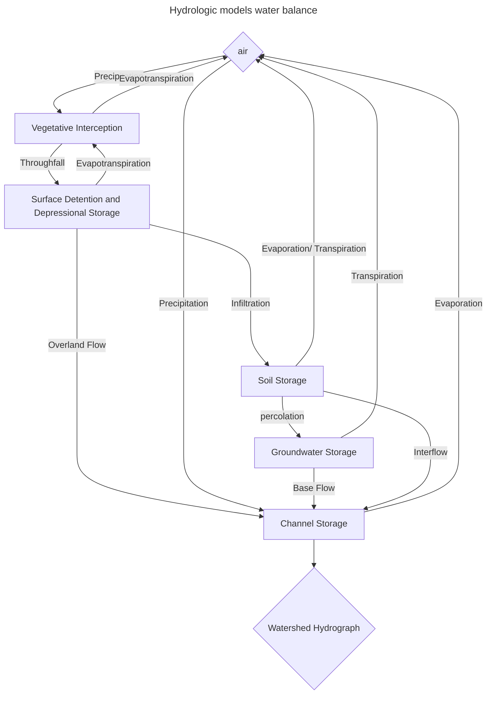

# Hydrologic Modeling of Small watersheds

This repo is meant to back up the work related to hydrologic modeling of small watersheds. 

Much of this repo is guided by Bruce N. Wilson Hydrologic Modeling of Small Watersheds and the class BBE 8513 at the University of Minnesota Twin Cities.

